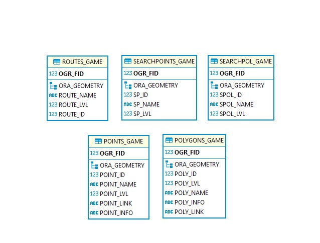
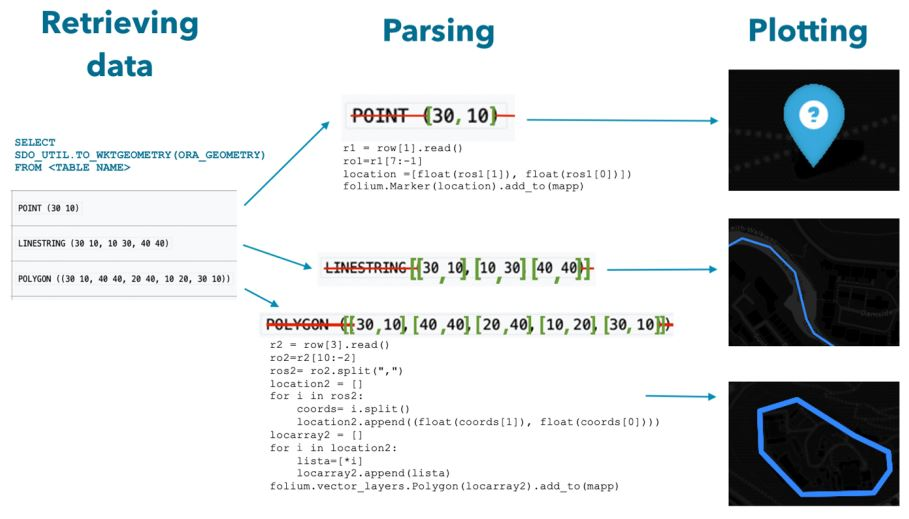

# :mag_right: GuessED :mag:

An Edinburgh-based landmark guessing game aimed at locals and non-locals alike.

Click [here](https://www.geos.ed.ac.uk/~s2236682/asdm/GuessED.html) to access the game.

## :world_map: Introduction

We created a database-driven guessing game that is based in Edinburgh using spatial queries.

- It's playable online
- It involves points, lines and simple polygon geometries in a geographic coordinate system
- It's making use of Oracle Spatial and its features

## :clipboard: Methodology
Our group took advantage of the capabilities offered by Oracle Spatial and integrated the database using the cx_Oracle Python extension module. Selected Edinburgh landmarks were digitised as points, polylines or polygons in QGIS and imported into Oracle using the OGR2OGR command line tool in in theOSGeo4W shell as shown below:

```sql
ogr2ogr -overwrite -f OCI OCI:<username>/<password>@database "C:\Workspace\Example.shp" -t_srs "EPSG:4326" -nln <TABLE NAME>
```

In the guessing component of the game, users are presented with a question, a map inset, a series of radio buttons from which to pick what they believe is the correct answer and, lastly, a hint on how to answer the question. Upon clicking on the “submit” button, a Python script runs, using Python extension module cx_Oracle to query our database.

## :file_cabinet: Database
### Data model
Our group took advantage of the capabilities offered by Oracle Spatial. 

GuessED’s data model comprises of 5 tables as seen below:

 

OGR2OGR automatically assigns a primary key (OGR_FID) to each table and saves the geometry as “ORA_GEOMETRY”. Furthermore, OGR automatically creates a metadata table and assigns a spatial index to objects in the ORA_GEOMETRY. [Learn more](https://gdal.org/drivers/vector/oci.html)

### :globe_with_meridians: Oracle Spatial
14 key landmarks were identified for querying. Accordingly, 14 different queries were designed to return each of them as the only possible answer. A few different query types were used to maximise the use of Oracle Spatial operators.

To identify the correctness of the submitted answer, once the selected option is submitted, the user-selected input is passed to the Python script and compared with the output of the spatial database query. If the two are identical, the answer is correct and the user is directed to the next question. Otherwise, the answer is incorrect and the user is directed back to the last page to answer the question again.

### :desktop_computer: Display Component
The game's display component uses folium maps that are embedded into each question's html page. These maps provide the user with contextual information and the tools to answer the question.

The data dispalyed on the maps is retrieved directly from the database via specifically designed queries. These return Oracle Spatial geometries that are converted to WKT format on-the-fly using the SDO_UTIL.TO_WKTGEOMETRY method. Then, using a Python script, each returned WKT object is transformed into a list of longitude and latitude coordinates, which are the passed into folium for plotting. A simplified diagram to illustrate the procedure is shown below:


## :brain: Project Team
**Team Leader:** Denise

**SQL Officer:** Daiqiao

**Python Officer:** Attila

## 
A group project for the Advanced Spatial Database Methods module at the University of Edinburgh.
